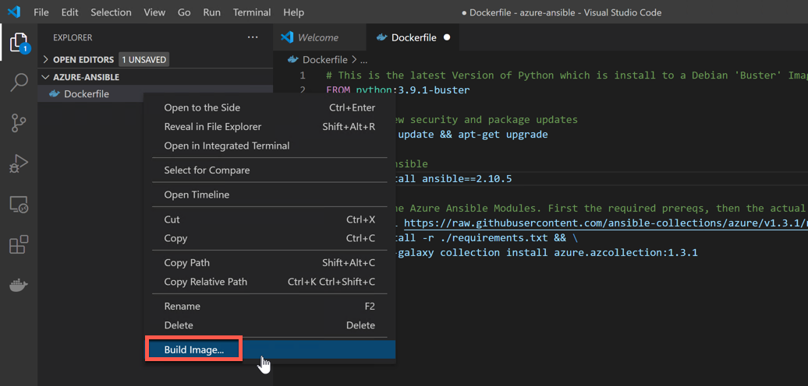
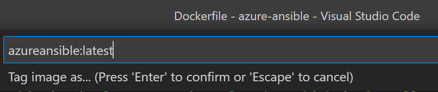
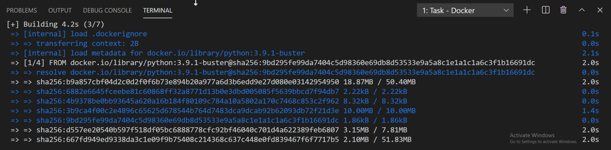
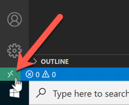
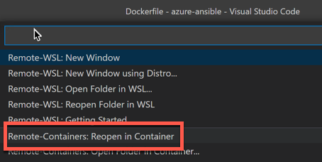
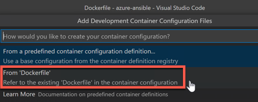
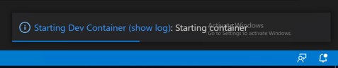
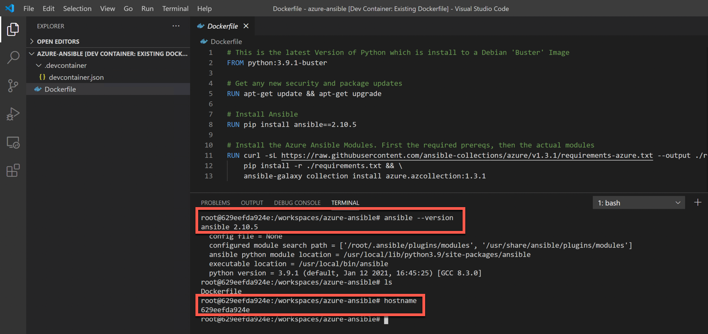
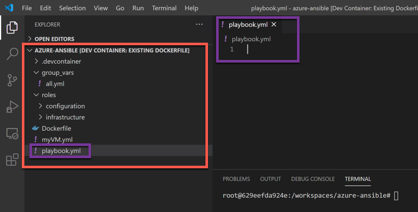




This post will quite lengthy, but it will outline how to use Ansible to deploy and setup Windows machines on Azure and achieve the automation holy grail and have Infrastructure as Code.
I'll show an efficient way to setup the development and deployment environment on Windows, which isn't something you could easily do until relatively recently.

One question might be 'What is Ansible and why use it?'. The best answer I have is that Ansible is a simple but powerful way to get started with Configuration Management of Infrastructure, and it is also a very hot trend right now in lots of areas. Ansible is starting to really dominate the market. Terraform is also a contender but it is more difficult to use well in my opinion, and the state file concept causes a few headaches that ansible can simply circumvent. I won't go too deep into it, but with Ansible we essentially declare a resource and tell Ansible we would like it created. Be it a VM, a disk, a software package installed on a Windows machine, you name it, ansible can likely do it. Terraform can also do most of this but stops short of simple OS configuration capability and it likes to keep track of what is created in a state file and it really starts to get complicated when you get an error, or worse, you lose your original state file.

# What We Will Do

So, we will perform the following steps;

 - Setup Docker on a Windows VM
 - Install VS Code  
 - Create an Azure Account
 - Create an Azure Service Principal Account
 - Create an Ansible Docker Container in VSCode
 - Create our Ansible Playbook  
 - Make a Basic VM and deploy it...

## VM Setup

So, first thing is to get a Windows machine for developing on. As long as you are running a version of Windows 10 newer than 2018ish you should be fine.

### Setup Docker 

So, first thing is to setup Docker on your Windows machine. I'll not rewrite a guide which will go out of date, so follow this link, but you need virtualization enabled in your BIOS as well, so be sure to do that first.

[https://docs.docker.com/docker-for-windows/install/](https://docs.docker.com/docker-for-windows/install/)

### Install VS Code

Install the 'Stable' VS Code from here - [https://code.visualstudio.com](https://code.visualstudio.com)


## Setup a Github Account (Optional)

Now, optionally, setup a github account - [https://github.com](https://github.com)

It is optional, but you probably want to do this to track your code. This post is not a git tutorial as adding that in would complicate things too much. Feel free to do so yourself though.

## Azure

Now, we need an Azure account. If you have one then great, if not, see the next step.

### Create an Azure Account

We need an Azure account. Go here and sign up! Sorry, no instructions, I'm sure you will figure it out :)

[https://azure.microsoft.com/](https://azure.microsoft.com/)


## Create an Azure Service Principal Account

We now need a way for the Ansible Playbook we create later to authenticate as 'us', but in a way that Ansible can understand. The easiest way to do this is to create what is called a 'Service Principal'. It's like an API key with permissions. The key point is to NEVER EVER NEVER store the values for this in github in a public repo (or even a private one). It is essentially a way to access an account for free and have someone else foot the bill. Be careful if using github and pushing your code.

To get a 'Service Principal' login to your Azure Account at [https://portal.azure.com](https://portal.azure.com)

Then, go to the 'Azure Active Directory' resource and choose to create a 'New registration' (I had to blur some existing ones I have, your's will be empty).


Call it something sensible like 'Ansible-Automation' and click 'Register'.


Now, we will have a 'Service Principal' created. Note down the 3 items highlighted (not in a file Git tracks!).


Then, click 'Certificates & secrets' and choose 'New client secret' and add a name and a duration (a year is recommended just so you never ever forget it exists, choose never expires with caution!)


Then, you get one chance to record the secret, so click the little clipboard icon and copy/paste somewhere and save it (again, definitely not in git!)


The Service Principal is now created, but it has no permissions. Let's give it 'Contributor' access to the subscription. Contributor is a powerful level of access which allows the creation of any resource, but not the ability to change permissions in Azure. It's about as good as it gets for someone to create resources though, so again, keep all this information secret and out of git ;)

Go to your subscription and choose 'Access Control (IAM)' and click 'Add'.


Then add our 'Service Principal' and give it a 'Contributor' role as explained above. Hit save, and we are done! 


Just make sure you have all 4 pieces of information handy about the 'Service Principal' handy from earlier;

- Tenant ID
- Application (Client ID)
- Object ID
- Secret

## Docker and VSCode

Now we are at a point where we can start to look at what we need to do next to create our Ansible environment. The first thing we need to do is create a 'dockerfile' which has the ansible setup we need to deploy to Azure. So, let's do that. 

### VSCode Setup

We also need some extensions for VSCode, but only a couple! Load VSCode and find and install these. 

- Docker
- Remote - Containers

These let us visually see that our dockerfile is correct and the 'Remote - Containers' extension lets us run a VSCode environment in a remote container, which lets us run ansible playbooks in that container. But, more to come on that. Next, we need a dockerfile.

### Create our Ansible dockerfile

You will have to take this on a certain amount of faith, but the code is well documented. If you have never used Docker before, just know that this file creates a base container from a debian image, installs a bunch of stuff and then we can run this as a place to run ansible from, on a Windows machine.

So, create a new folder on your Windows machine and open it in VSCode using the 'Open Folder' option. Create a file called 'Dockerfile' (no extension) and copy/paste this code.

```dockerfile
# This is the latest Version of Python which is install to a Debian 'Buster' Image
FROM python:3.9.1-buster

# Get any new security and package updates
RUN apt-get update && apt-get upgrade

# Install Ansible
RUN pip install ansible==2.10.5

# Install the Azure Ansible Modules. First the required prereqs, then the actual modules
RUN curl -sL https://raw.githubusercontent.com/ansible-collections/azure/v1.3.1/requirements-azure.txt --output ./requirements.txt && \
    pip install -r ./requirements.txt && \
    ansible-galaxy collection install azure.azcollection:1.3.1
```

## Create an Ansible Docker Container in VSCode

Now, right click the file and choose 'Build Image'. If Docker is setup correctly it will happily build this for us. Give it a name (default is fine) and watch the build occur. It will take a couple of minutes. Note that we have an Image in our docker images list afterwards.








## Run a Remote Container VSCode Instance











## Create an Ansible Role Playbook

We can now create an ansible playbook, or more specifically, a role. This command creates a file/folder structure for a role which we can use to create our Azure setup.
```
root@629eefda924e:/workspaces/azure-ansible# ansible-galaxy init azureinfra
- Role azureinfra was created successfully
```




- Make a Basic VM and deploy it...
